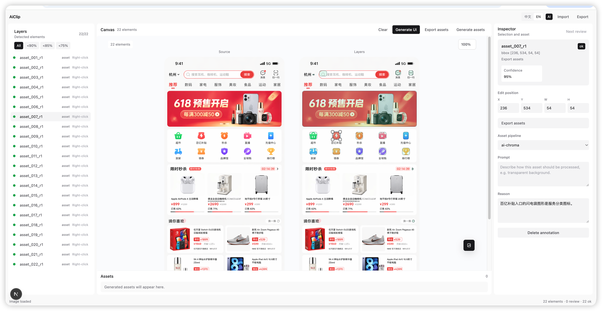
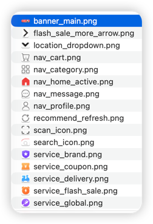

# AiClip

## 截图

### 标注工作台



### 资产生成结果



AiClip 可以把 UI 截图转换成一套结构化的素材处理流程：自动标注视觉素材、自动切成素材拼图，并对需要重绘的素材生成干净绿幕结果，最后导出透明 PNG。

> 当前模型支持：项目目前仅支持使用 `gpt-5.5` 做截图分析，使用 `gpt-image-2` 做图片重绘 / 绿幕素材生成。

## 功能

- 自动标注图标、插画、装饰、Logo、头像等视觉素材。
- 自动从上传截图中切出素材，并生成素材拼图。
- 自动对 `ai-chroma` 素材进行绿幕重绘，再后处理成透明 PNG。
- 支持手动调整识别框、素材名称、提示词和资产处理方式。
- 资产处理方式只有两种：
  - `ai-chroma`：默认方式，适合图标、插画、装饰和不确定素材。
  - `crop`：原图裁剪，适合商品图、banner、照片、头像、Logo、截图等需要保留原像素的素材。

## 安装

安装 Node 和 Python 依赖，配置 `.env.sample` 或 `.env.local`，然后启动开发服务：

```bash
npm install
python3 -m pip install -r requirements.txt
npm run dev
```

AiClip 在生成资产时会调用本地 Python 脚本 `scripts/process_chroma_icons.py`，用于扣除绿色 chroma 背景并导出透明 PNG，所以运行 Next.js 服务的机器需要可用的 `python3` 和 Pillow。

## 环境变量

本地测试可以直接修改 `.env.sample`，也可以复制成 `.env.local` 保存私有配置：

```bash
cp .env.sample .env.local
```

`.env.local` 会被 Git 忽略；`.env.sample` 可以提交，但里面只能放占位值。

需要配置：

```env
BASEURL=https://your-api-host.example/v1
APIKEY=replace-with-your-api-key
AI_MODEL=gpt-5.5

IMAGE_BASEURL=https://your-image-api-host.example/v1
IMAGE_APIKEY=replace-with-your-image-api-key
IMAGE_MODEL=gpt-image-2
```

## 使用流程

1. 上传 UI 截图。
2. 应用自动分析截图并生成可编辑的素材标注。
3. 检查或调整标注框、素材名称、提示词和处理方式。
4. 生成资产。
5. 下载透明 PNG 素材和 manifest。

## 使用下载后的资源包

下载的 zip 会包含：

- `source.png` / `source.jpg`：原始 UI 参考图。
- `assets/`：AiClip 生成的透明 PNG 素材。
- `assets.json`：素材元数据。
- `prompt.md`：可以直接给 coding agent 使用的还原提示词。

你可以把资源包发给 coding agent，然后直接引用 `prompt.md`。提示词内容类似：

```md
请参考 `source.png` 这张 UI 原图，使用当前切图包进行 UI 还原。

要求：
- 还原整体布局、层级、间距、颜色、字体风格和视觉比例。
- 涉及图标、插画、装饰图、头像、Logo、商品图等素材时，优先使用切图包内 `assets/` 目录的素材。
- 不要用图标库或重新绘制替代已有切图素材，除非资源包里确实没有对应素材。
- 保持素材透明背景、原始比例和视觉细节。
```

## Star History

[](https://www.star-history.com/#shouzi23333-rgb/AiClip&Date)
